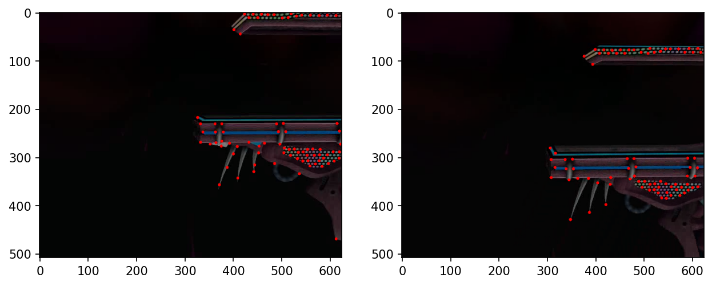

## Melee Vision
A computer vision project to track and analyze video footage of [SSBM](https://www.ssbwiki.com/Super_Smash_Bros._Melee), Smash Smash Bros Melee.


#### Context
Nowadays, SSBM analysis uses data from controller inputs and game states 
thanks to the incredible [Project Slippi](https://slippi.gg/) ([github](https://github.com/project-slippi/project-slippi)).
Some Slippi stats include damage dealt, opening conversion rate, kill moves, and timestamps.
But Slippi must be used during gameplay to record that data, and so all the games played pre-Slippi era (~2018?), 
as well as games continuing to be played on setups without Slippi, do not benefit.
There's so much untapped info in this footage.

This is a fantastic, albeit difficult, case for computer vision to step in. 
The data is...
- abundant: over 340 pages of [archived videos](https://vods.co/melee) of tournament footage;
- relatively structured: video can be messy, but game features are consistent - 
screen dimensions, rules, stages, characters, etc;
- meaningful: knowing movement patterns and other trends will give key insight into a player's decision-making and habits, 
leading to quantified and well-described analysis like never before.

#### This project...
...is an attempt to accurately track 2 characters in the video from a standard SSBM game, 
and then identify the character states to some degree. That alone would bring new, useful data. 

But if successful, it can go further to get more precise, performant, and detailed, with more opportunities. 
Examples:
- Heatmap of character position on stage ([someone did that](https://swoodivarius.github.io/Final.html) using Slippi)
- List of most common habits - ledge getups, OOS options, teching (eg 60% roll right, 20% in-place), ...
- AI trained to play in certain player style, learning from video(s) of that player. (Imagine playing against Armada resurrected as a computer!)

## Demo

More deliverables still underway...

## Usage

#### Docker
`docker build https://github.com/wong-justin/melee-vision.git -t your/nameforthis`

`docker run -p 8888:8888 your/nameforthis`

The build command takes a little while, but now it's running on localhost on your machine.
Don't forget to run with `-p 8888:8888`.
It will give some output after you run, like the following:

```
To access the notebook, open this file in a browser:
        file:///root/.local/share/jupyter/runtime/nbserver-1-open.html
    Or copy and paste one of these URLs:
        http://685d642fe150:8888/?token=06c195f789a1511e3b643dc234e015ce4939e06d5b4a2188
     or http://127.0.0.1:8888/?token=06c195f789a1511e3b643dc234e015ce4939e06d5b4a2188
```
Copy the last URL and paste into a browser to view the container's working directory with Jupyter, where there are notebooks for viewing and python source code if you want to dig deeper.

## Progress
Current focused goal is to find strong keypoints (eg corners of platforms and ground) in an image of the stage from an arbitrary camera position (ie battlefield),
use an appropriate descriptor (eg BRIEF), and use those to match two slightly shifted/rotated frames of the same stage.

When that works well, consecutive frames can be stitched together to develop a fixed model of the stage based on keypoint positions.
Normal footage can be compared against that model to find current camera position, 
as well as to find where pixel content differs the most from the model and hence conclude the character's position.
Note - this strategy fails for stages with ground that morphs, namely Pokemon Stadium and kinda Dreamland.

### Source Code
Notebooks are the primary way to interact with the code and see results of different functions.
[background.py](./background.py) contains the latest code with keypoint detection, descriptor calculating, and matching.
[test.py](./test.py) has some performance tests and feature tests. Many tests become broken, though,  as modules update in functionality and get refactored.

## Options/Settings
not friendly to configure image processing parameters in the middle of functions, but you can.

## Compatibility
Just run the Docker container; no worries!
Python packages just in case you need to know:

- matplotlib==3.2.1
- numpy==1.16.4
- opencv-python==4.2.0.34

You need a browser to view the notebooks from the container; see Usage.

## Contribute

The code still has a way to go before correctly analyzing a video to any degree.
Keypoint detection has been ok, but getting and matching descriptors has not been accurate enough yet.
If you have any coding skills, advice, or ideas that will help the general goal, feel free to pitch in. See the Progress section.

Maybe find someone skilled in the computer vision field and point them here. I'm new to this.

There's many resources to support any sort of SSBM project: 
a nice emulator, custom mods/hacks/codes, an in-game debug mode, guides and setup tutorials, discords and forums and subreddits, expert individuals, and a large, passionate community around it all.
People hesitant to help should be assured that the game is still growing today, 
and any work done on projects like this will only be more supported and valuable.

## License
MIT License