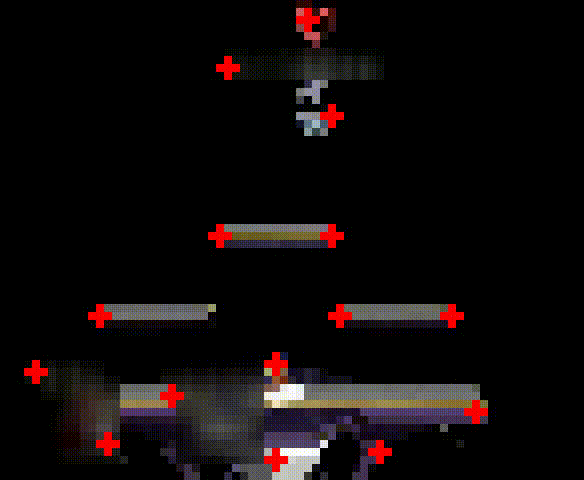

## melee vision
A computer vision project to track and analyze video footage of [SSBM](https://www.ssbwiki.com/Super_Smash_Bros._Melee), Smash Smash Bros Melee.

## Demo

#### Context
Nowadays, SSBM analysis uses data from controller inputs and game states
thanks to the incredible [Project Slippi](https://slippi.gg/) ([github link](https://github.com/project-slippi/project-slippi)).
Some Slippi stats include damage dealt, opening conversion rate, kill moves, and timestamps.
But Slippi must be used during gameplay to record that data, and so all the games played pre-Slippi era (~2018?),
as well as games continuing to be played on setups without Slippi, do not benefit.
There's so much untapped info in this footage.

This is a fantastic, albeit difficult, case for computer vision to step in.
The data is...
- abundant: over 340 pages of [archived videos](https://vods.co/melee) of tournament footage;
- relatively structured: video can be messy, but game features are consistent - characters, stages, etc;
- meaningful: knowing movement patterns and other trends will give key insight into a player's decision-making and habits,
leading to quantified and well-described analysis like never before.

#### This project...
...is an attempt to accurately track 2 characters in the vods of a standard game of melee,
and then identify the character states to some degree. That alone would bring new, useful data.

Example uses of analyzing game footage:
- Heatmap of character position on stage ([someone did that](https://swoodivarius.github.io/Final.html) using Slippi)
- List of most common habits - ledge getups, OOS options, teching (eg 60% roll right, 20% in-place), ...
- AI trained to play in certain player style, learning from video(s) of that player. (Imagine playing against Armada resurrected as a computer!)

## Progress
Current goal is to find good descriptors for image keypoint features (eg corners of stage and platforms) so that they can be matched between frames of slightly different camera positions.

Then frames can be stitched together to generate a model of the stage, and the dynamic content (ie characters, projectiles) can be extracted per frame.

## Options/Settings
`settings.json` should have `"iso_path"="path/to/melee/rom"`

## Compatibility
Only tested on Windows.

## Contribute

Yes please. Some tasks that could use help are computer vision, interfacing with Slippi Dolphin, bug reports, testing, anything.

## License
MIT License
